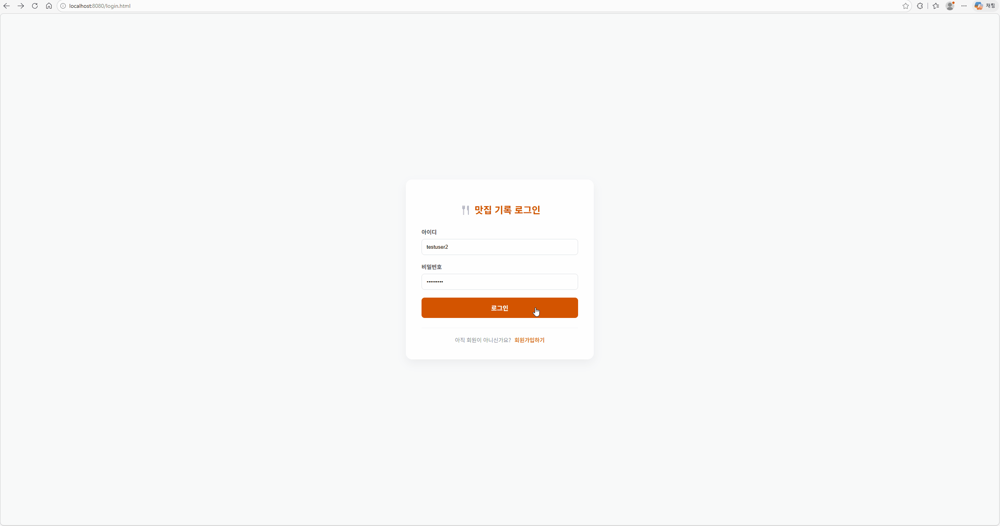
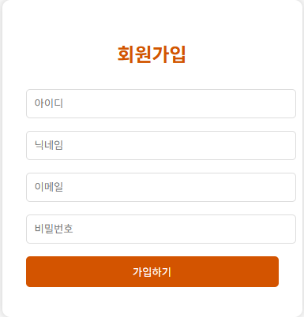
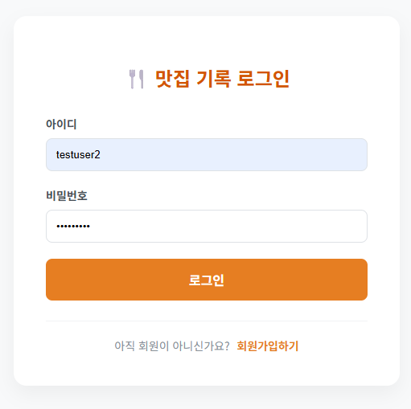
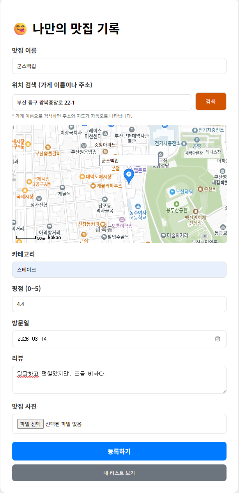
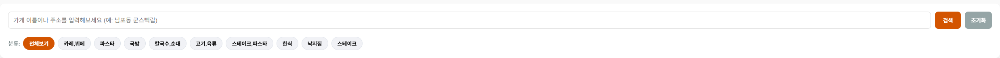
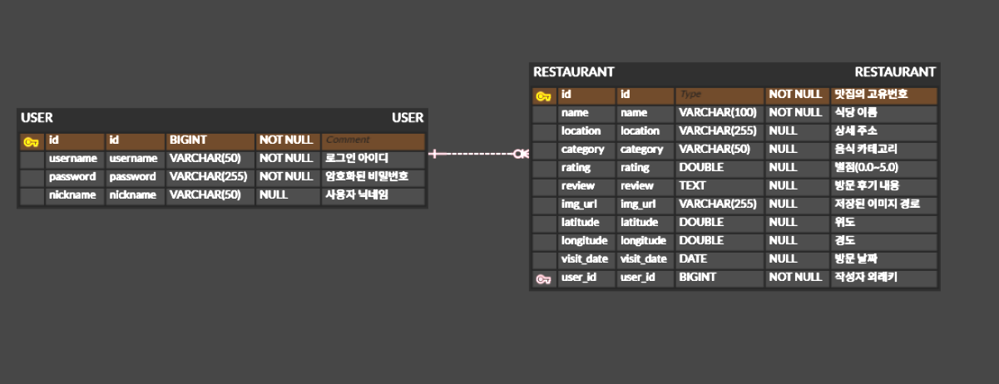
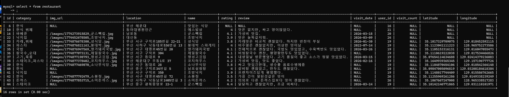
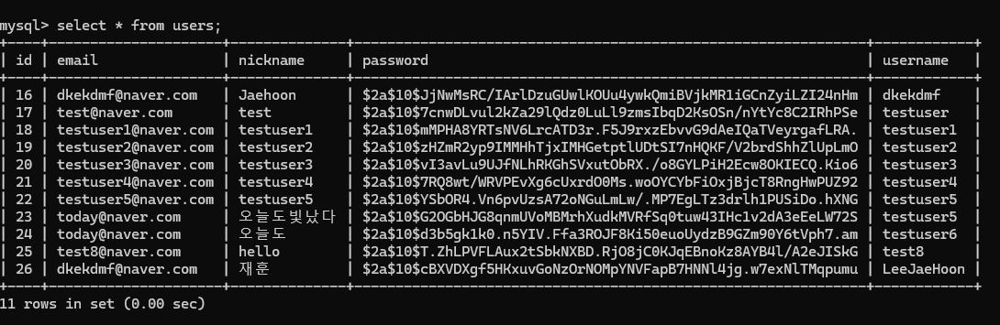

# My Restaurant Record (나만의 맛집 기록)

> 방문한 맛집을 지도 위에 기록하고, 카테고리별로 관리하는 서비스입니다.

---

## 📸 프로젝트 미리보기 (Preview)

---

## 🚀 주요 기능

### 1. 사용자 인증 및 개인화 서비스
사용자별로 독립적인 데이터를 관리하며, 로그인 시 개인화된 메시지를 제공합니다.

<table>
  <tr>
    <td align="center"><b>회원가입</b></td>
    <td align="center"><b>로그인</b></td>
  </tr>
  <tr>
    <td></td>
    <td></td>
  </tr>
</table>

* **BCrypt 암호화**: 비밀번호 보안 해싱 적용
* **개인화 화면**: 로그인 세션에 따른 맞춤형 대시보드 출력 (`jaehoon.png`)

### 2. 맛집 정보 관리 (등록/수정)

* Kakao Maps API를 통한 위치 기반 등록 및 기존 데이터 수정 기능

### 3. 카테고리 필터링 및 대시보드

* 한식, 일식 등 카테고리별 마커 필터링 기능을 강조합니다.

---

## 💾 Database Architecture

### 실제 SQL 저장 데이터

---

## 💻 시작하기
1. `git clone https://github.com/your-username/MyRestaurantRecord.git`
2. `application.properties` 설정 수정 후 실행