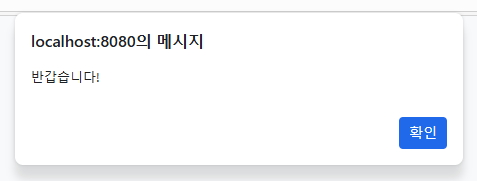
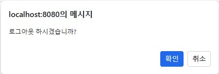
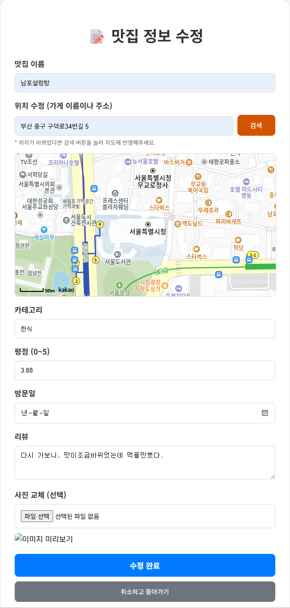
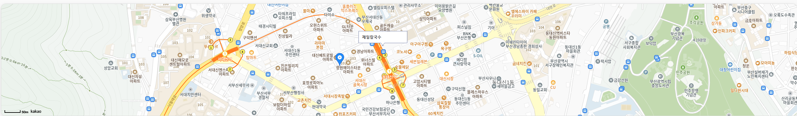
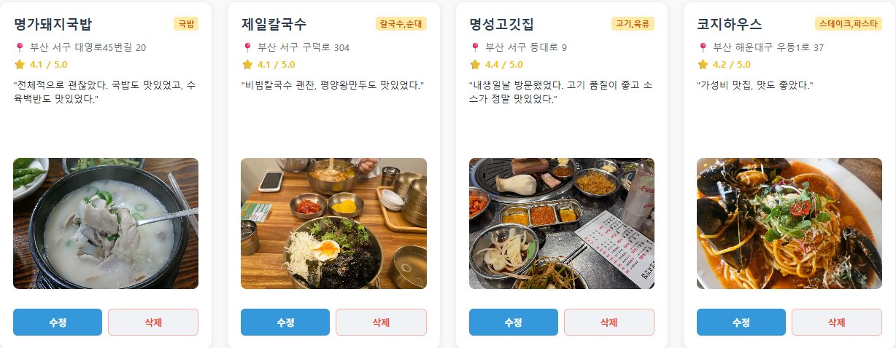
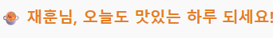
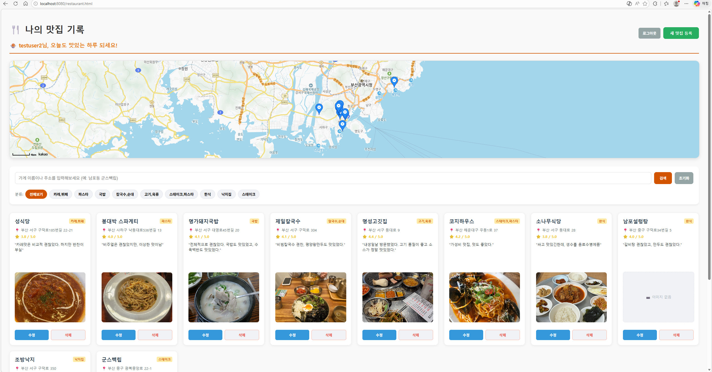
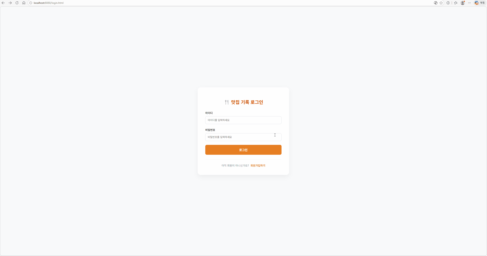

# 나만의 맛집 기록하기🍜

## 프로젝트 소개
이 레포지토리는 내가 직접 방문한 맛집들을 기록하고 관리하기 위한 프로젝트입니다.  
맛집의 위치, 메뉴, 방문 후기 등을 정리하여 나만의 맛집 데이터베이스를 만드는 것을 목표로 합니다.
## 데이터베이스 설계
- ER 다이어그램

    
## 주요 기능
- 회원가입, 로그인, 로그아웃(JPA,MySQL,HttpSession)
    
    
    
    
    <!--  -->

- 방문 날짜와 리뷰, 평점, 위치, 이미지 업로드 작성
    
    

- MySQL DB를 활용한 데이터 관리

    
    
- 카테고리별 정리

    
- 지도 기능

    
- 맛집 리스트 기능

    

- 사용자별 맞춤 관리   
    
    
- 전체화면

    

## 사용 방법
1. 회원가입 및 로그인 기능입니다.
 
    
2. 새로운 맛집을 발견하면 웹/앱을 통해 입력합니다.
    

3. 맛집 카테고리별 정리 및 검색기능 입니다.
    
4. 맛집 수정 및 삭제, 지도 보기 기능입니다.    
    

